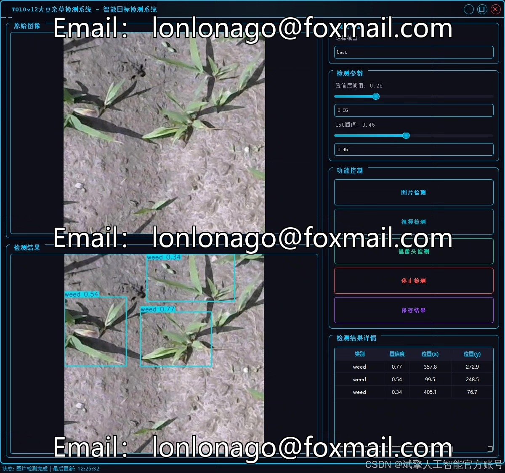
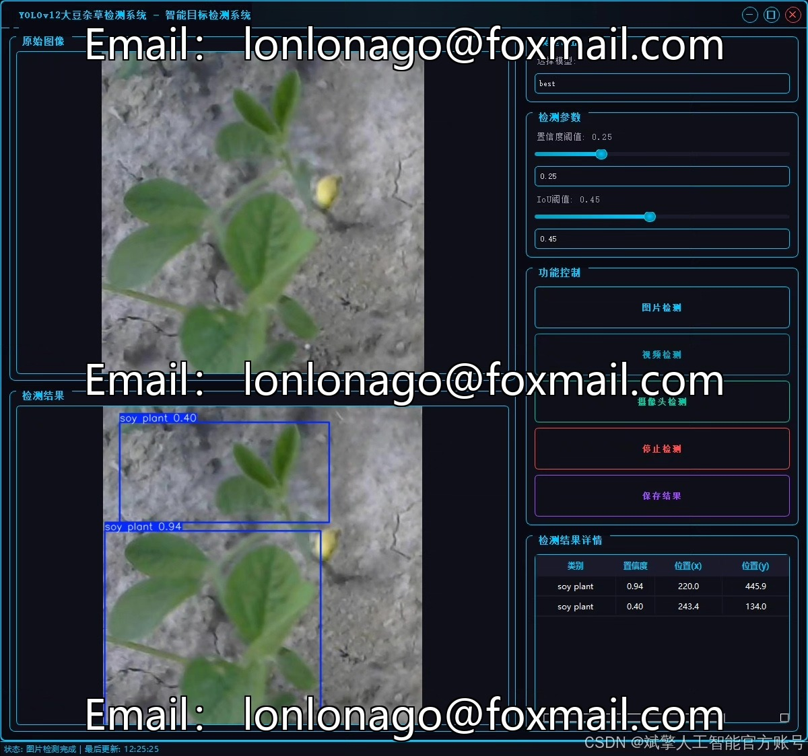
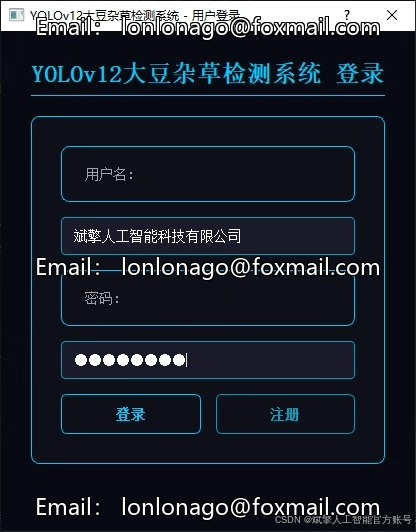
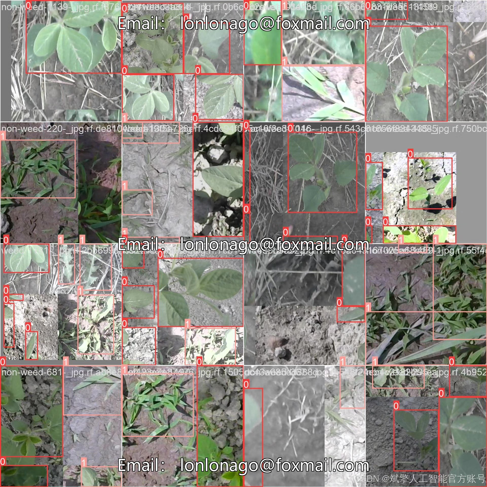
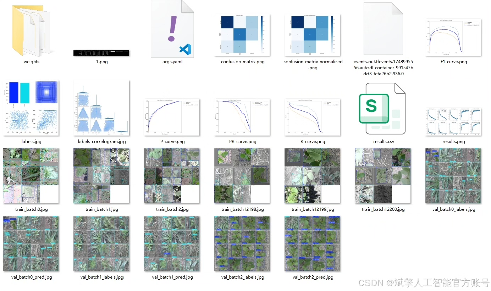
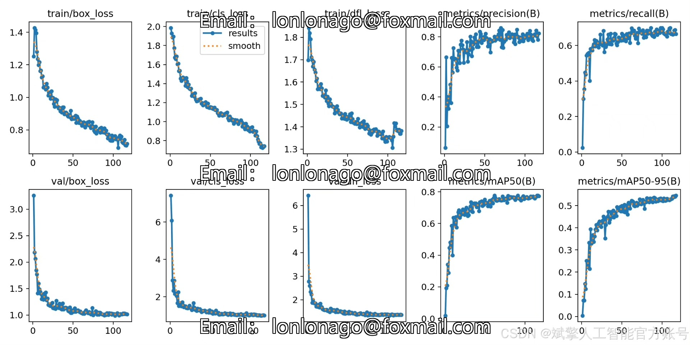
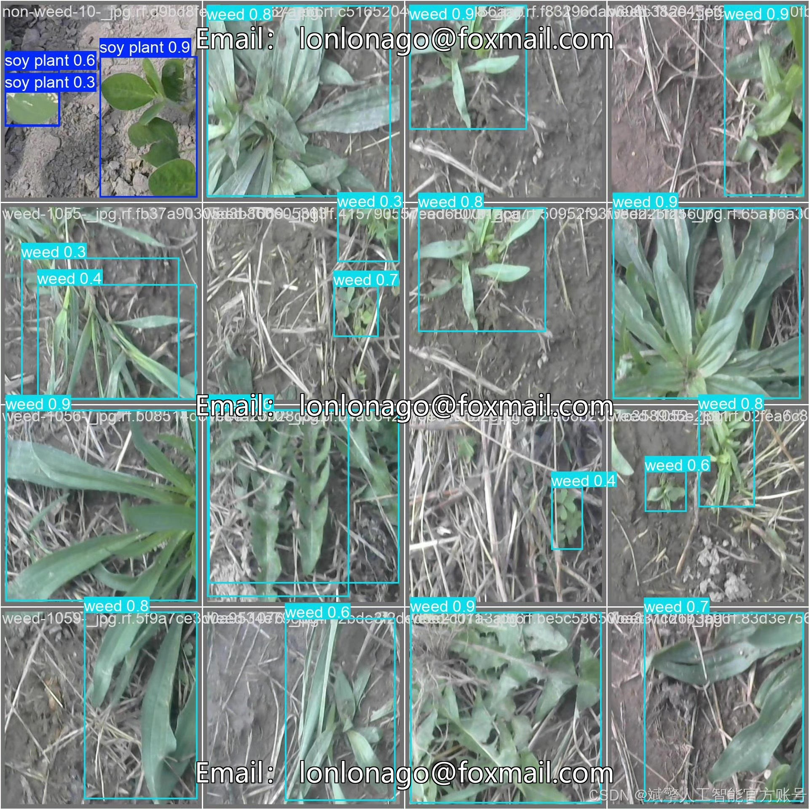

# YOLOv12 Soybean Weed Detection System

## Body

YOLOv12 Soybean Weed Detection System Based on Deep Learning YOLOv12

This paper designs and implements a soybean weed detection system based on the deep learning YOLOv12 model. It integrates the YOLO format labeled dataset with a user-friendly UI interface, providing an automated solution for weed management in precision agriculture. The system employs an improved YOLOv12 model to efficiently detect both soybean plants ('soy plant') and weeds ('weed'). The training set, validation set, and test set each contain 908, 260, and 134 images respectively, ensuring the model's generalization capability. The system incorporates a login registration interface and an interactive UI.

✅ User Login Registration: Supports password verification and security validation.
✅ Three Detection Modes: Based on the YOLOv12 model, supports image, video, and real-time camera detection, accurately identifying targets.
✅ Dual-Screen Comparison: Displays the original image and detection results side by side on the same screen.
✅ Data Visualization: Real-time table displays the category, confidence, and coordinates of detected targets.
✅ Intelligent Parameter Tuning: Offers a confidence slide bar to dynamically optimize detection accuracy, adapting to different scene requirements.
✅ Sci-Fi Interactive Interface: Dark theme paired with dynamic light effects reduces visual fatigue and enhances operational experience.

## Images

## Payment

Here is a pay link on Stripe ( https://buy.stripe.com/3cs8yP7sY87d0vu9AB ). Please contact me lonlonago@foxmail.com after funding $89, and I will send you a complete data files , thank you!

